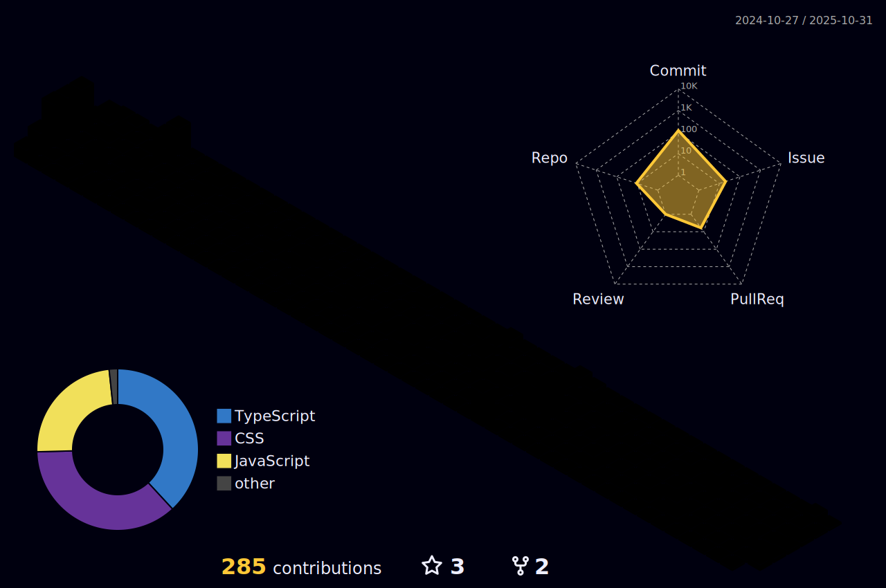

 
 
 
 
 

   
 

    <a href="https://github.com/joao-pedro01">
    
    
     
 

 
 ##
 <h3>Operating Systems</h3>
 
 
  
   
   
   
 

 
 
 ##
 <h3>Tools and technologies</h3>
 
 
  
   
   
   
   
    
   
   
   
 

  
##
 
  <h3>Front-End</h3>
 
 
  
   
   
   
   
   
   
   
 

 
##
 
 <h3>Back-End</h3>
 
 
  
   
   
   
   
   
 

 
##

 <h3>Mobile</h3>
 
 
    
   
 

 
##
 
<h3>Contribution charts 📊</h3>
  

	
	 
 	

 
##
 

 
 <h3>contact me:</h3>
  
  
 
 ##
 
  
 
  ##
 
  <h3>
   Total Visits in profile :detective:  
   

     
   </h3>
  

 
##

  

  

